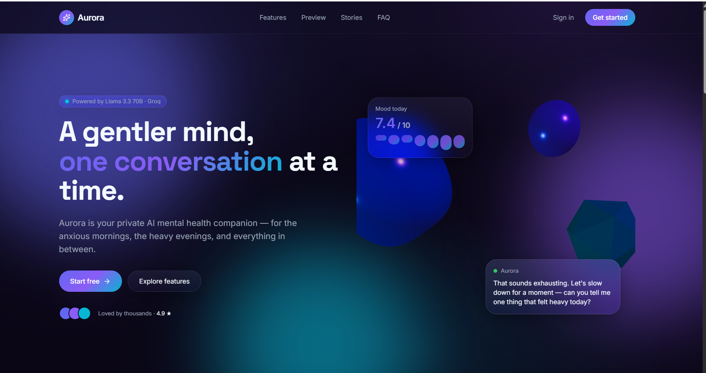
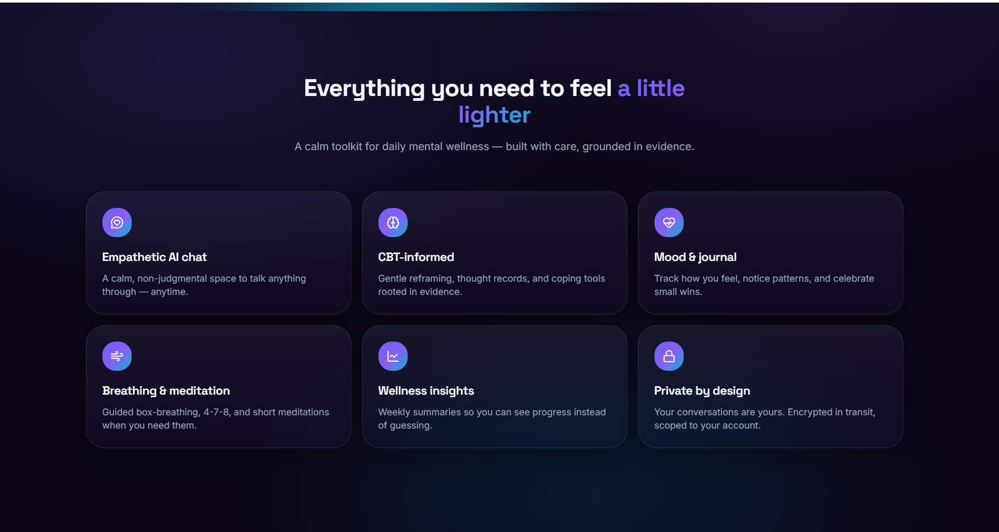
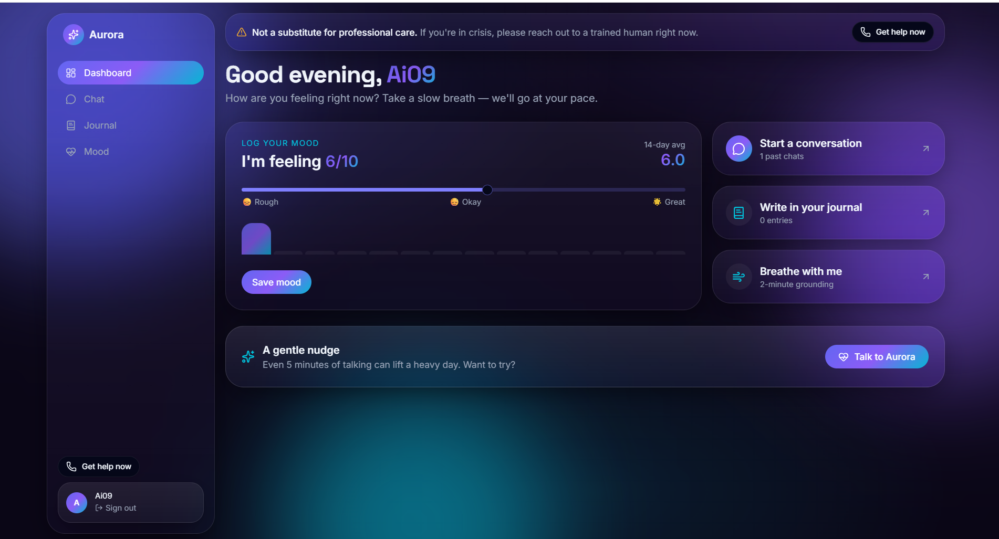
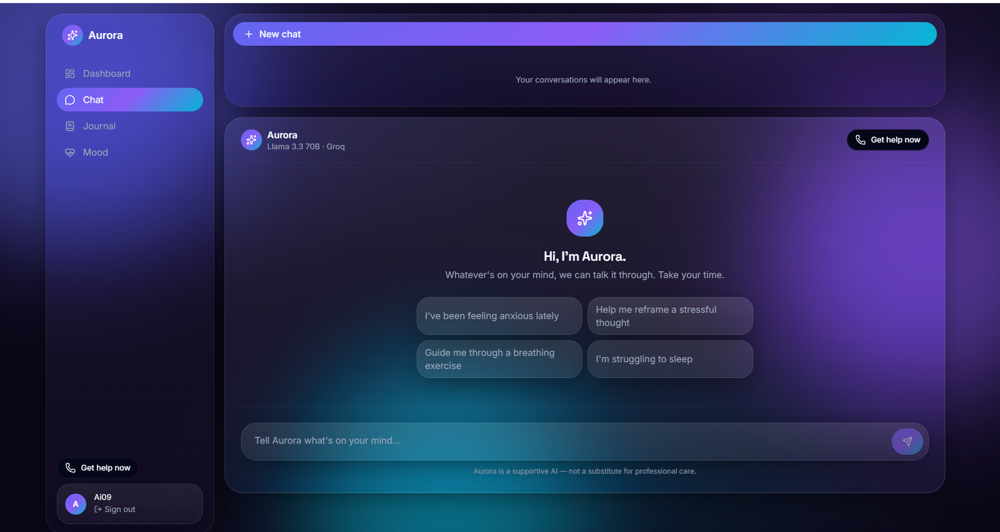

 # 🧠 AI Mental Health Counselor

> A Production Ready AI Powered Mental Health Counselor built with **React, FastAPI, Groq API, PostgreSQL, and Three.js**, featuring a premium **3D Glassmorphism UI**, intelligent AI conversations, mood tracking, journaling, and personalized wellness support.

---

## ✨ Features

- 🤖 AI Powered Mental Health Chatbot using Groq API
- 💬 Real time conversational interface with chat history
- 🔐 Secure Login & Sign Up with JWT Authentication
- 📄 PDF & Document Upload with AI Powered analysis
- 😊 Mood Tracking & Daily Journaling
- 🧘 Breathing Exercises & Guided Wellness
- 📊 Personal Dashboard & Progress Analytics
- 🌙 Beautiful 3D Glassmorphism UI
- 📱 Fully Responsive Design
- ⚡ FastAPI Backend + PostgreSQL Database

---

# 🏠 Home Page

### Home Page 1

<p align="center">
  
</p>

---

### Home Page 2

<p align="center">
  
</p>

---


# 📊 Dashboard

<p align="center">
  
</p>

---

# 💬 AI Chat

<p align="center">
  
</p>


---

# ⚙️ Tech Stack

## Frontend

- React
- Vite
- TypeScript
- Tailwind CSS
- React Three Fiber
- Three.js
- Framer Motion
- Zustand
- React Router
- Axios
- React Hook Form
- Zod
- React Markdown

## Backend

- FastAPI
- Python
- Groq API
- SQLAlchemy
- PostgreSQL
- Redis
- JWT Authentication
- Alembic
- Uvicorn

---

# 📂 Project Structure

```text
AI-Mental-Health-Counselor/
│
├── frontend/
│   ├── src/
│   ├── public/
│   └── package.json
│
├── backend/
│   ├── app/
│   ├── routes/
│   ├── models/
│   ├── services/
│   └── main.py
│
├── assets/
│   ├── home1.png
│   ├── home2.png
│   ├── home3.png
│   ├── login.png
│   ├── dashboard.png
│   ├── chat.png
│   ├── mood.png
│   ├── journal.png
│   ├── upload.png
│   └── wellness.png
│
└── README.md
```


# 🌐 Deployment

- **Frontend:** Vercel
- **Backend:** Render / Railway
- **Database:** Supabase PostgreSQL
- **Storage:** Cloudinary

---

# 📌 Future Enhancements

- Voice to Voice AI Conversations
- AI Therapist Personas
- Multi language Support
- Emotion Detection from Voice
- Mobile App (Flutter/React Native)
- AI Appointment Scheduler

